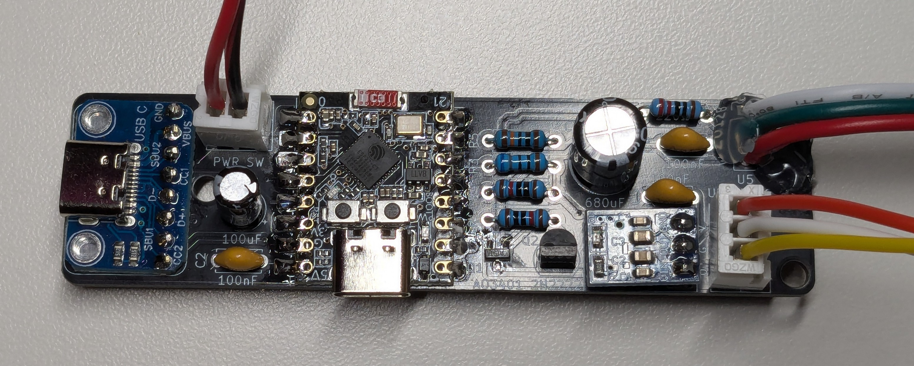
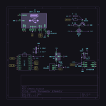
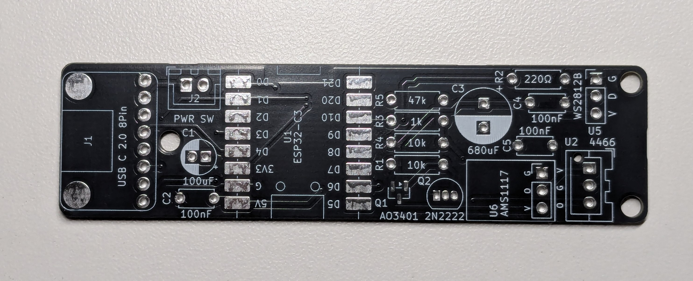

# Sound Thermometer

A quick ESPHome project that illuminates an addressable LED strip based on sound levels detected by a microphone module.

## Features

- Custom LED effect that lerps between two colors based on sound level
- Configurable sound sensitivity and LED colors via ESPHome webui
- Support for USB C and A power source capability detection
- Safety kill switch via a mosfet to disable the LED load if the power source doesn't support enough current
- AP mode fallback
- OTA over webui for easy updates

## Photos



## Hardware Design

### Schematic Diagram



### PCB Layout




## Components

- Microcontroller (ESP32-C3 Super Mini)
- WS2812B LED strip
- Microphone module with analog out (e.g., MAX9814)
- AMS1117-3.3 Voltage Regulator for clean mic module power
- P-Channel MOSFET for power control (AO3401)
- P2N2222A NPN transistor for mosfet driving
- USB C 8-pin breakout dashboard with 5.1k resistors for CC pins (designating the device as a power drain)
- Bulk and filter capacitors
- A few resistors (see schematic for details)

## Usage

Once configured and integrated with Home Assistant:

1. View live temperature readings in the dashboard
2. Set up automations to trigger audio announcements at specific temperatures
3. Receive notifications when temperature thresholds are exceeded
4. Monitor device status and connectivity

## ESPHome Installation & Configuration

### Prerequisites

- ESPHome installed on your system
- Home Assistant instance (optional, for integration)
- A compatible microcontroller (as defined in your configuration)
- USB cable for flashing

### Setup Instructions

1. **Clone or download this configuration:**
   ```bash
   git clone https://github.com/H3mul/esphome-sound-thermometer.git
   ```

2. **Create or update your ESPHome configuration file:**
   - Use the provided `esphome.yaml` file in this directory
   - Adjust any pins, WiFi credentials, or device settings as needed
   - Add your own `secrets.yaml` with sensitive information referenced in the config

3. **Flash the device:**
   ```bash
   esphome run esphome.yaml
   ```

4. **Access the webui:**
   - Once flashed, the device will either connect to your WiFi or create an access point
   - Connect to the same network as the device and access the ESPHome dashboard via the device's IP

## Support & Documentation

For more information about ESPHome configuration, visit:
- [ESPHome Official Documentation](https://esphome.io/)
